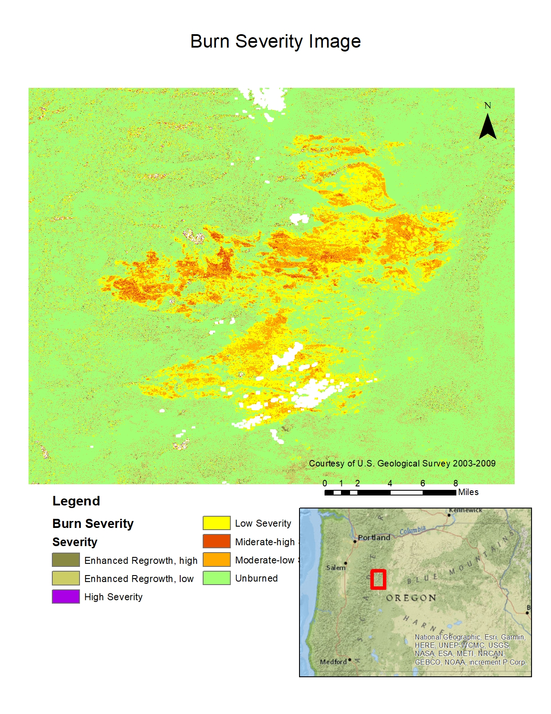
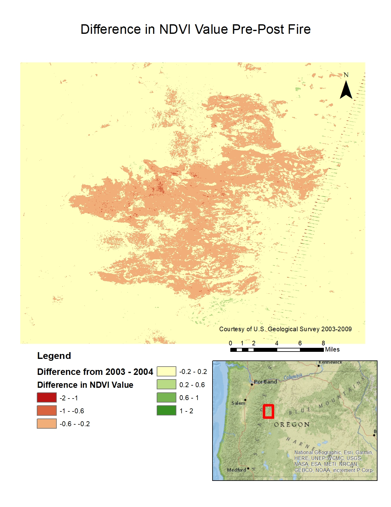
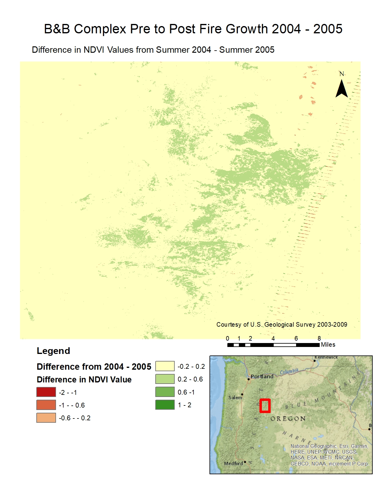
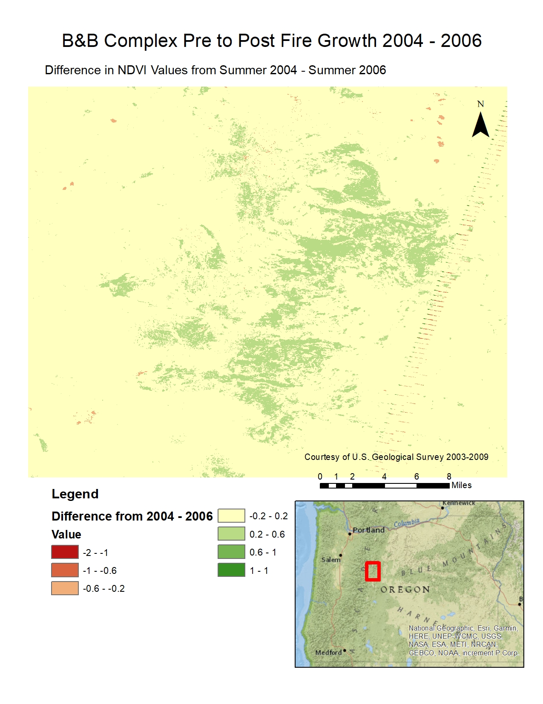
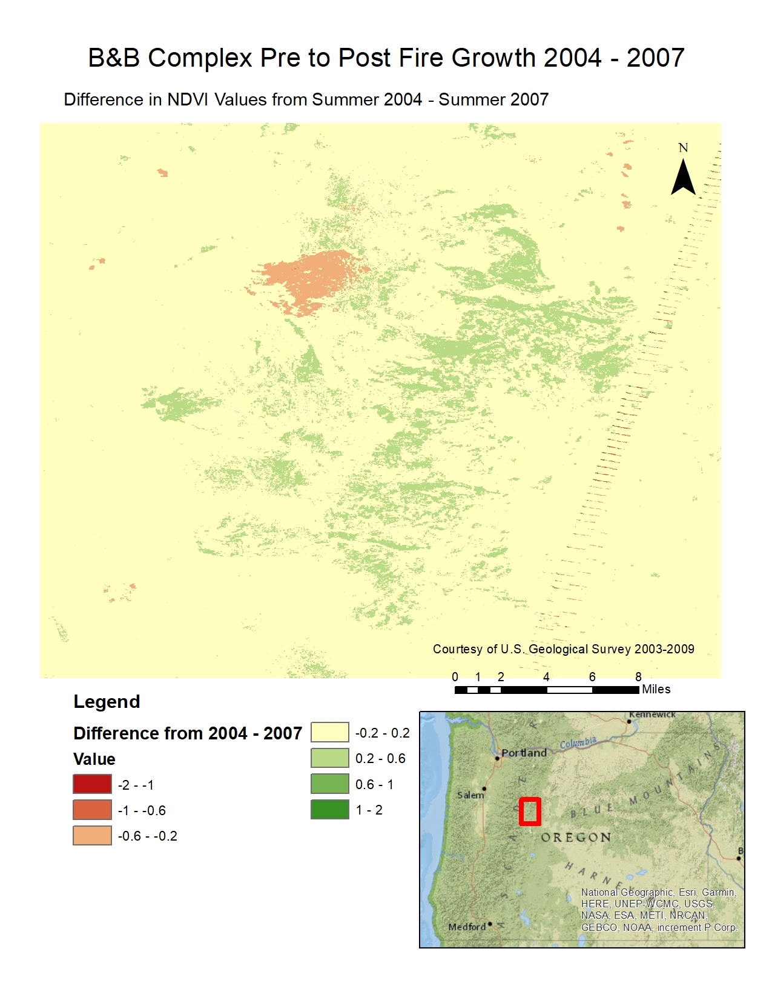
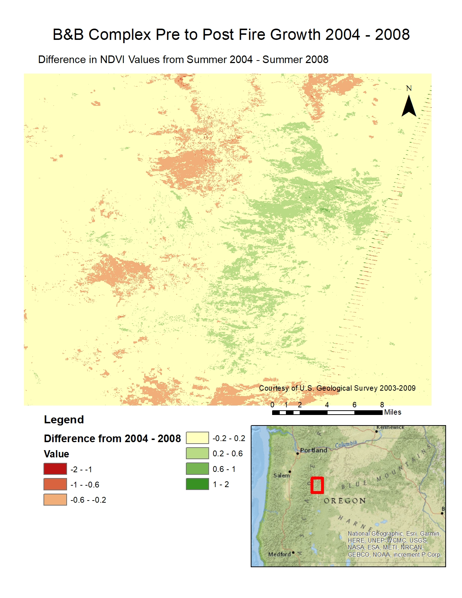
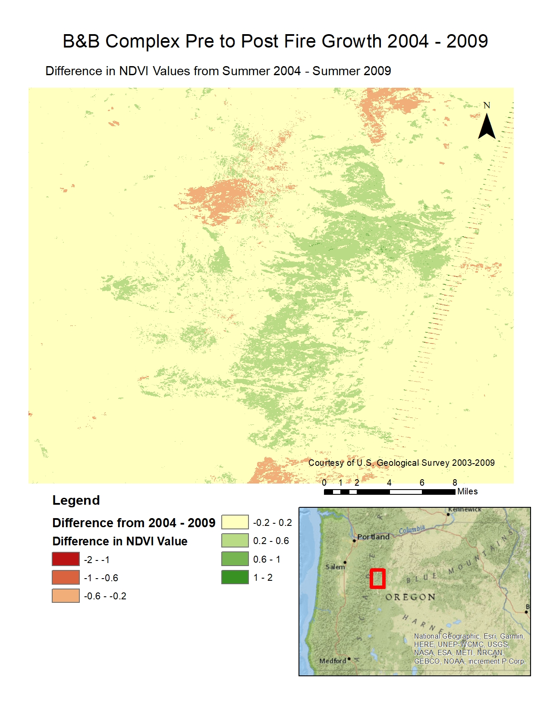

# B&B Complex Fires Vegetation Regrowth

## Introduction:

This was the final project for my Remote Sensing II class at the University at Albany. The project analyzed the burn severity and the vegetation regrowth post-fire of the B&B complex fires in Oregon in 2003.

[Read the Full B&B Complex Fires Paper](maps/B%26B_Complex_Fires.pdf)

## Process:

* Software used:
    * **Google Earth Engine**: calculated NBR, composited images, masked clouds, downloaded image collections
    * **ArcMap**: calculated NDVI, created difference images, combined images
    * **Excel**: created change Matrices
* Data used: **Landsat 5**

## Conclusions:

The area burned by the B&B Complex fires was mostly burned with a low or moderate severity. More of the burned areas showed vegetation growth than unburned areas, and of those, the moderate-low and miderate-high burn severity areas showed the most area that had regrowth. Areas with high or low burn severity showed slightly less regrown areas. While the area did show overall regrowth over the years, there was a bit of a dip in regrowth between 2007 and 2008, likely due to environmental factors.

