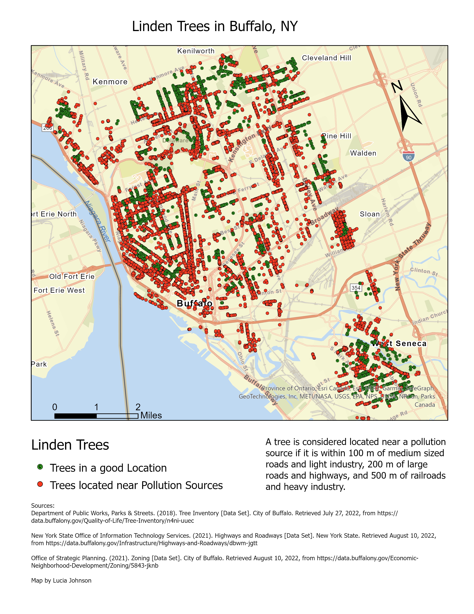
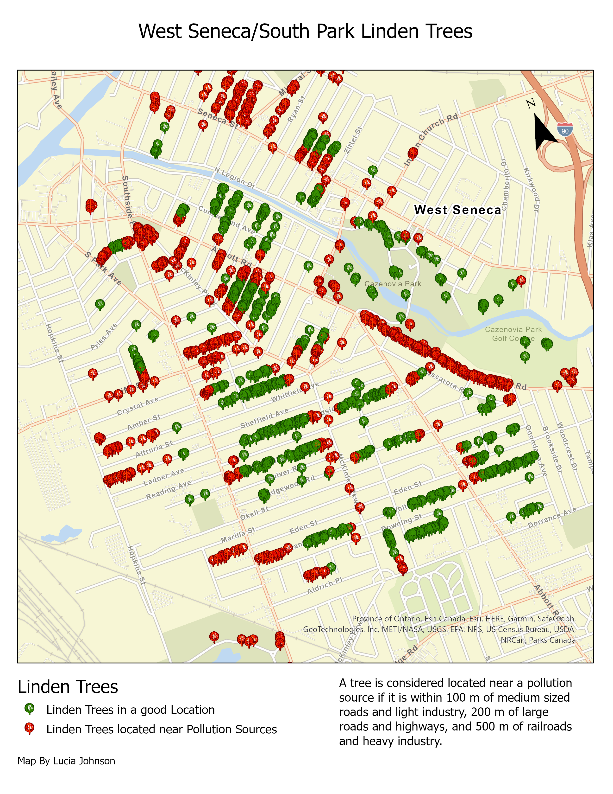
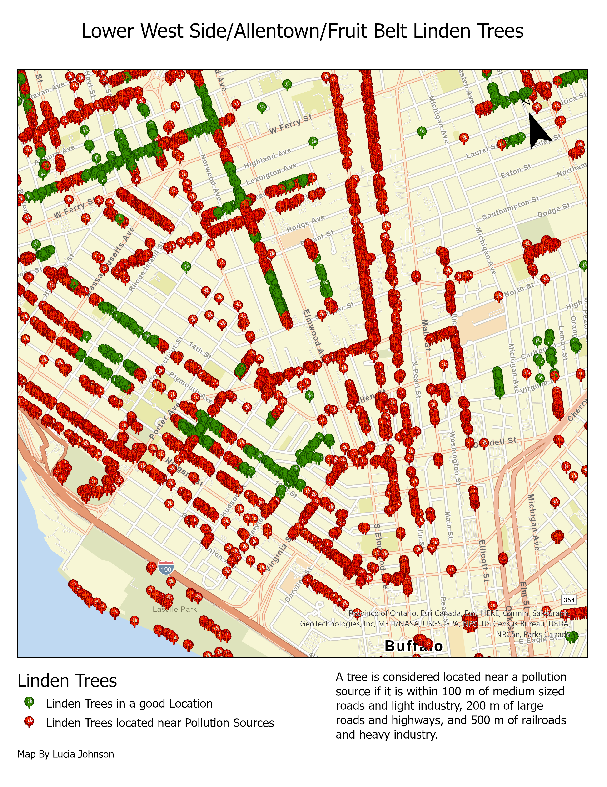
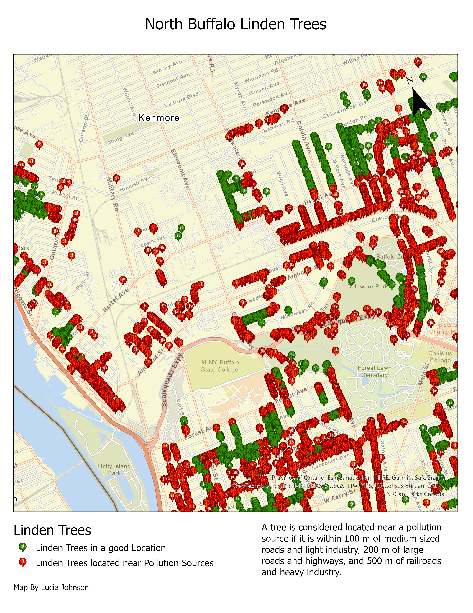
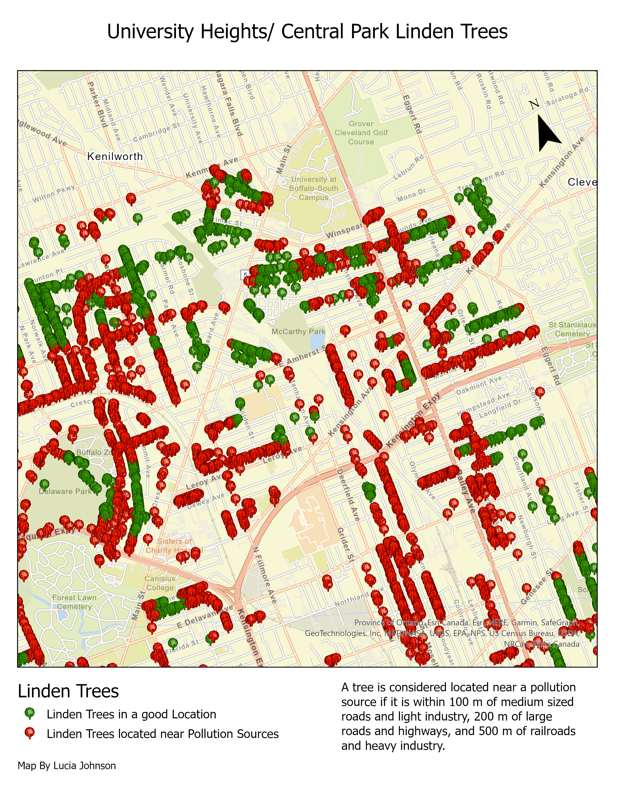
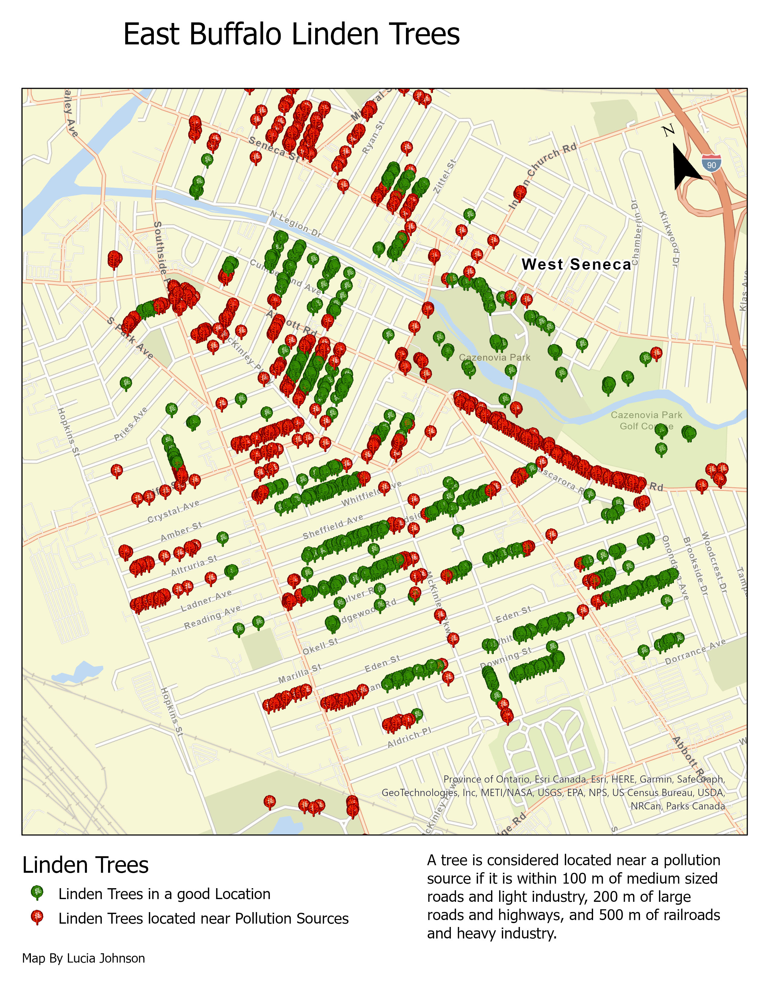

# Buffalo Linden Trees

This is a map of all the Linden trees in Buffalo, NY. I got the idea for this map after watching [this video from the Black Forager](https://fb.watch/fexb8qlX45/) about how you can make something chocolate-like from the seed pods of the Linden tree. Tea made from Linden flowers is also one of my favorite teas. I wanted to make a map of areas where I could forage from Linden trees, ideally away from any major sources of pollution. It turns out that there are a LOT of Linden trees in Buffalo.

* Software used: **ArcGIS Pro**

The data was found on the [Buffalo Open Data Portal](https://data.buffalony.gov/). The tree data came as a CSV file, and I also used a dataset on zoning and one with highways and roads, both of which came as Shapefiles. I used the Buffer tool to create the "Pollution Zones".

[Download the Buffalo Linden Map PDF](maps/BuffaloLindenTrees.pdf)