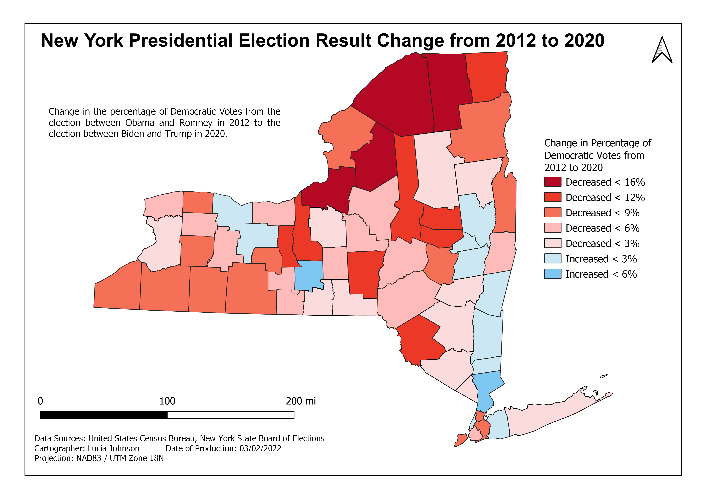

# NY Election Results

I made this map as a part of my Intro to Geospatial Technologies class at the University at Albany. 

We were supposed to map a feature of our choice from a dataset with election results in New York state in the 2012 and the 2020 election. I wanted to practice using formulas to calculate features, so I calculated how much the percentage of Democratic votes changed between the two elections. I found that in most counties in New York the percentage decreased from 2012 to 2020.

* Tools used: **QGIS**

