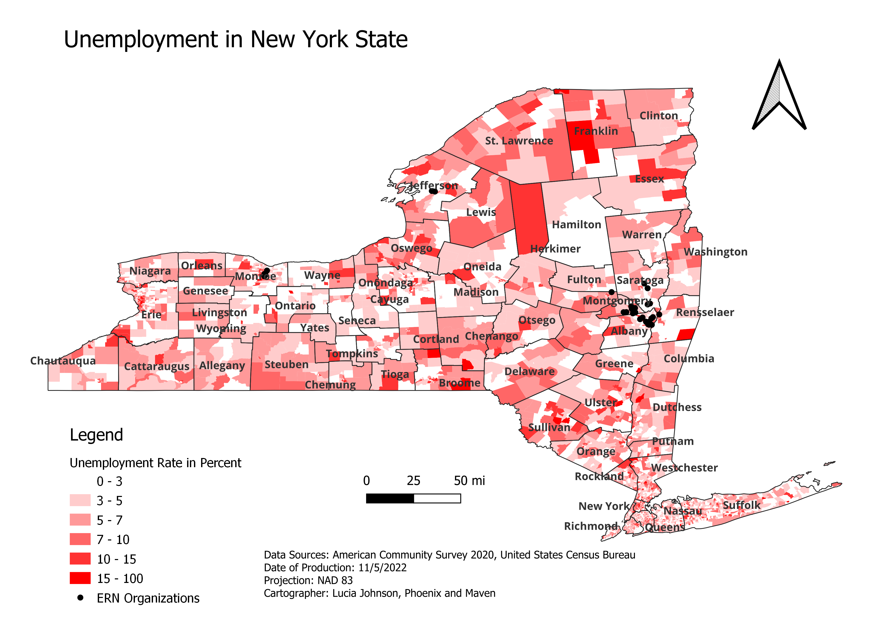
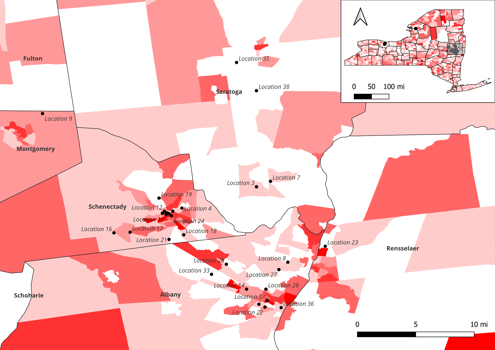
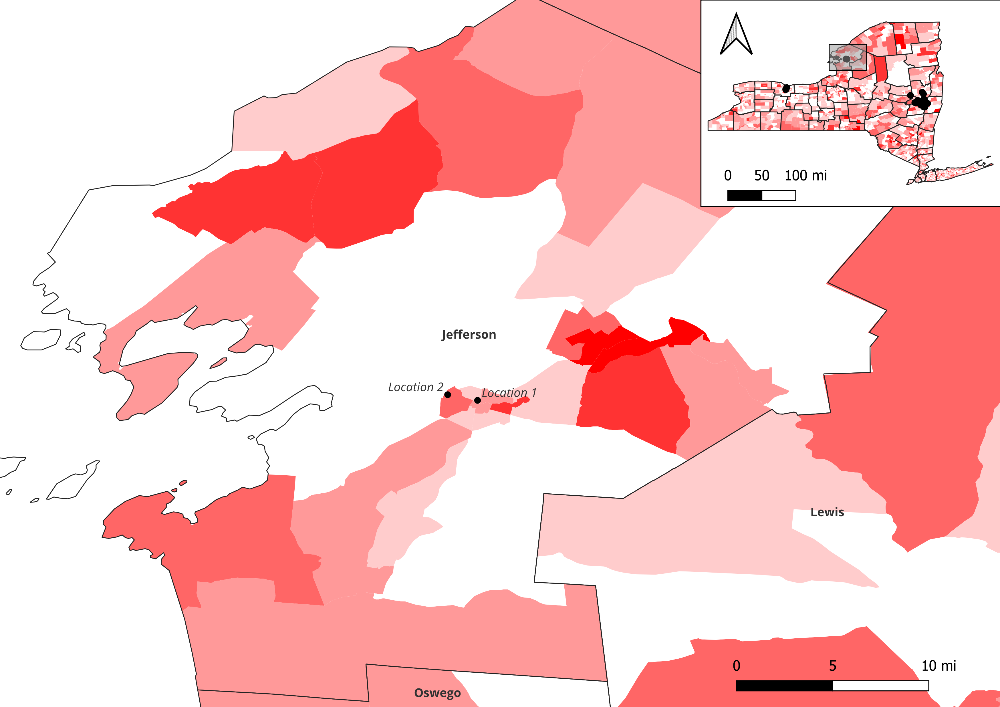
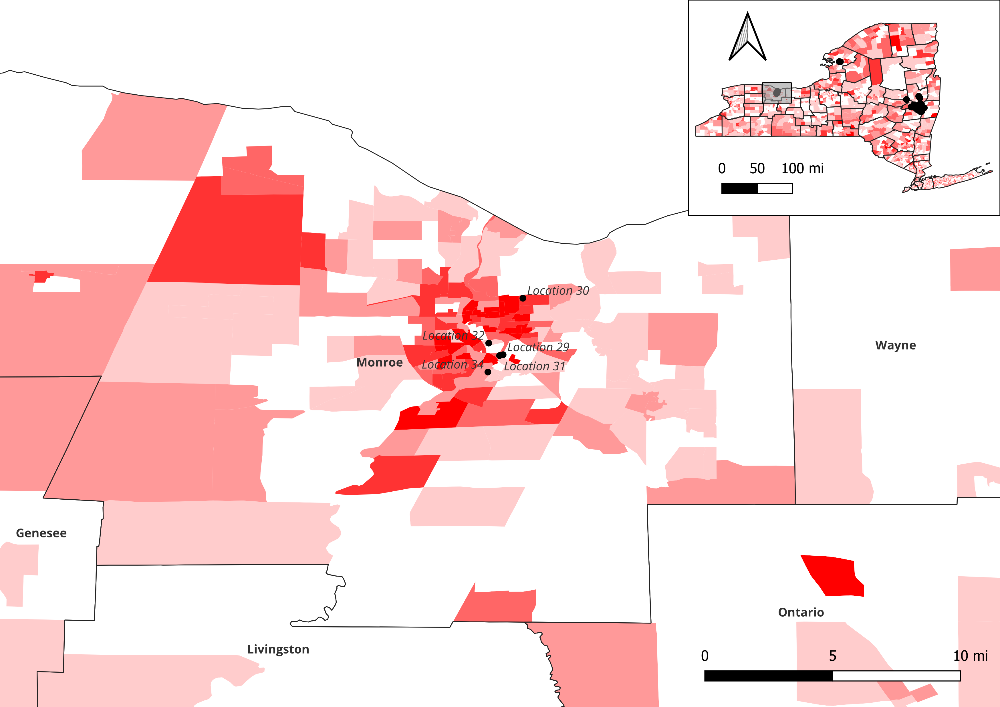

# NY Unemployment

I made this map at my place of employment. It was made as a presentation to a client in order to see if they would be interested in having more maps made to help further their goals.

I used the unemployment rate taken from the 2020 American Community Survey and I added points for the locations where the client has a presence (the names are obscured on this map for privacy purposes). I provided a small scale map of the whole state and then a few large scale views around the areas where the client has a presence.

* Software used: **QGIS**

