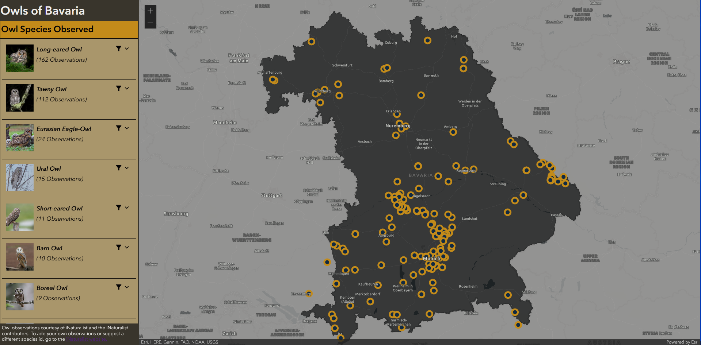
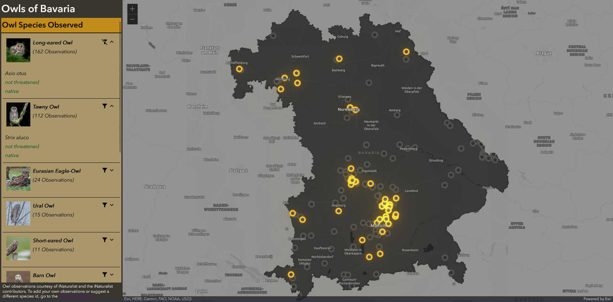
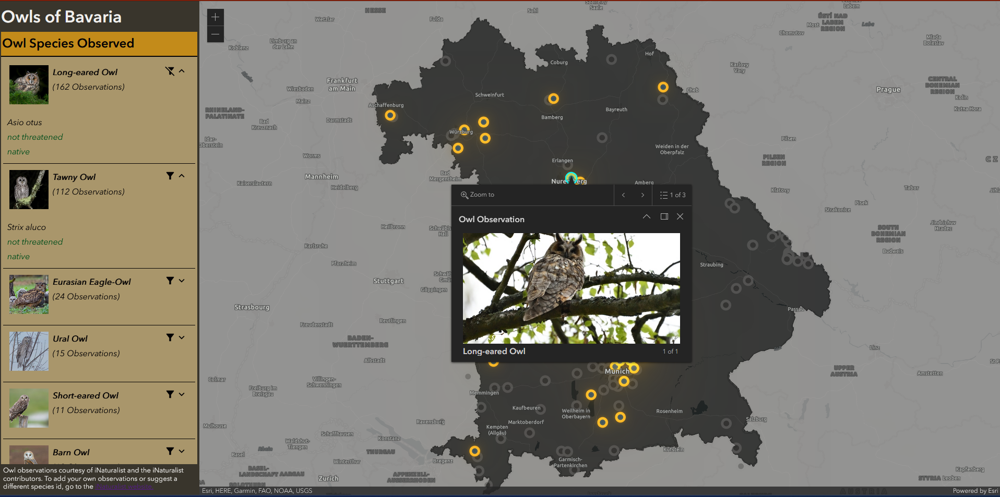
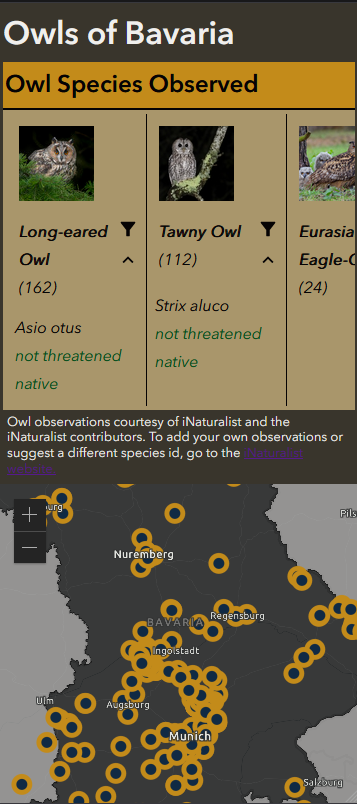
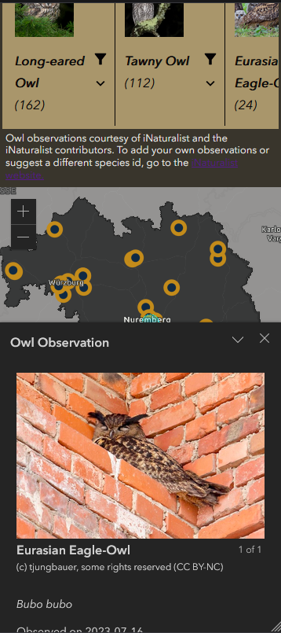

# Owls of Bavaria

This is a web mapping application that displays owl observations in Bavaria. I am building it in honor of my mother who is a big fan of birding, and especially owls.

[Go to the Owls of Bavaria live website](https://owls-of-bavaria.pages.dev)

[Go to the Owls of Bavaria GitHub repository](https://github.com/lujoh/owls_of_bavaria)

* APIs used: **ArcGIS Maps SDK for JavaScript**, **iNaturalist REST API**
* Libraries & Languages used: **React**, **Redux**, **JavaScript**, **HTML**, **CSS**

The website features a map of Bavaria with owl observations that can be opened by clicking on the markers. The left side of the website shows a breakdown of the owl species observed with additional information and counts of each species. Filtering by owl species will initiate a Feature Effect that highlights the included owl markers and greys out those of excluded species.

I also created a mobile view of the website which rearranges the layout to make it a bit more mobile-friendly.

The data and images for the owl observations are taken from [iNaturalist](https://www.inaturalist.org/) which is "an online social network of people sharing biodiversity information to help each other learn about nature" and "a crowdsourced species identification system and an organism occurrence recording tool". I would encourage people who are interested in nature, whether that is owls, insects, plants, or more, to sign up for iNaturalist and start contributing observations.

 

