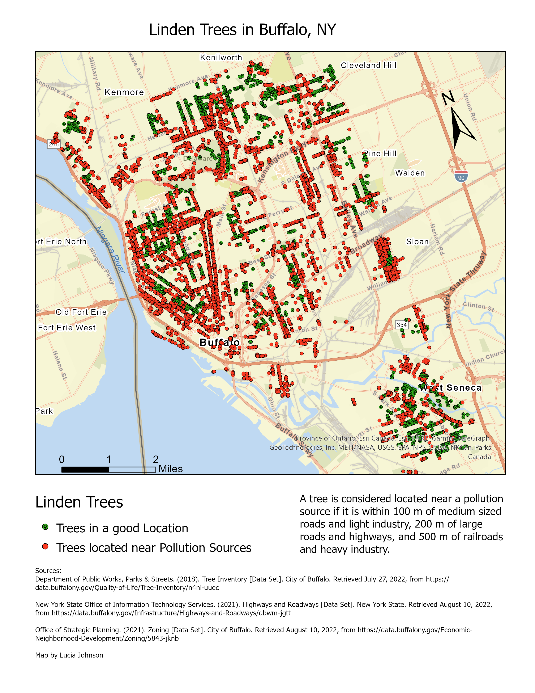
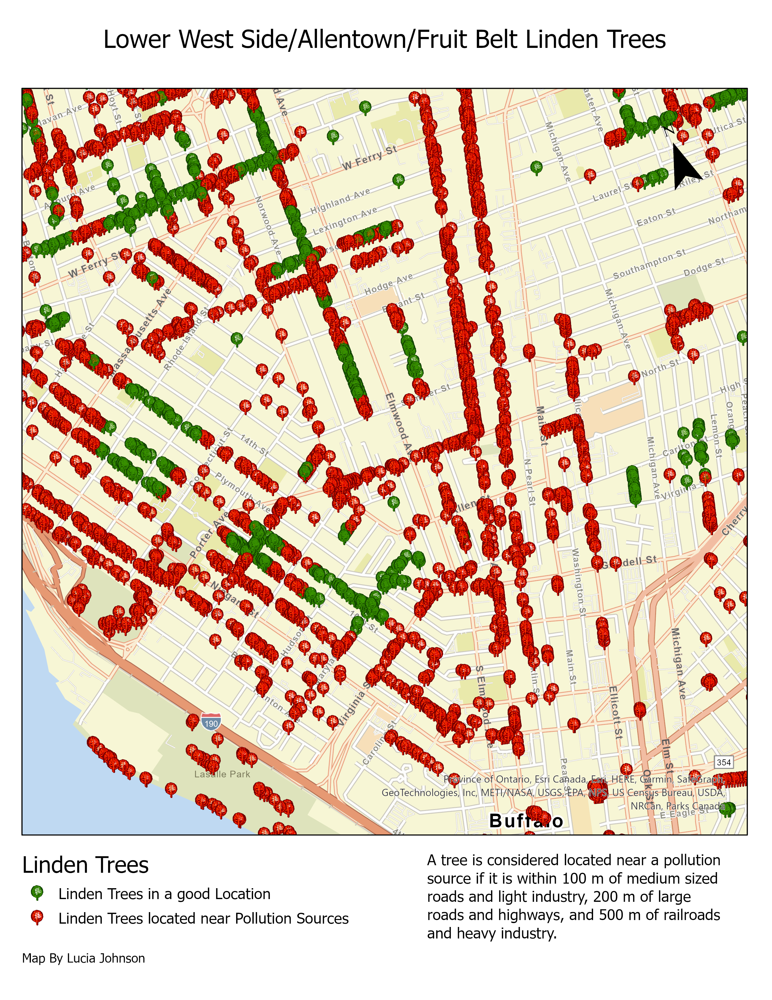
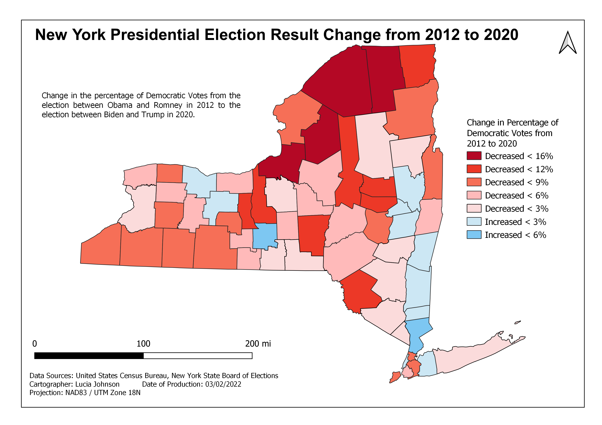

# Map Practice

This is a repository of maps and spatial projects by Lucia Johnson to keep track of my progress in map making.

## 2. Buffalo Linden Trees

This is a map of all the Linden trees in Buffalo, NY. I got the idea for this map after watching [this video from the Black Forager](https://fb.watch/fexb8qlX45/) about how you can make something chocolate-like from the seed pods of the Linden tree. Tea made from Linden flowers is also one of my favorite teas. I wanted to make a map of areas where I could forage from Linden trees, ideally away from any major sources of pollution. It turns out that there are a LOT of Linden trees in Buffalo.

* Tools used: **ArcGIS Pro**

## 1. NY Election Results

I made this map as a part of my Intro to Geospatial Technologies class at the University at Albany. We were supposed to map a feature of our choice from a dataset with election results in New York state in the 2012 and the 2020 election. I wanted to practice using formulas to calculate features, so I calculated how much the percentage of Democratic votes changed between the two elections. I found that in most counties in New York the percentage decreased from 2012 to 2020.

* Tools used: **QGIS**

